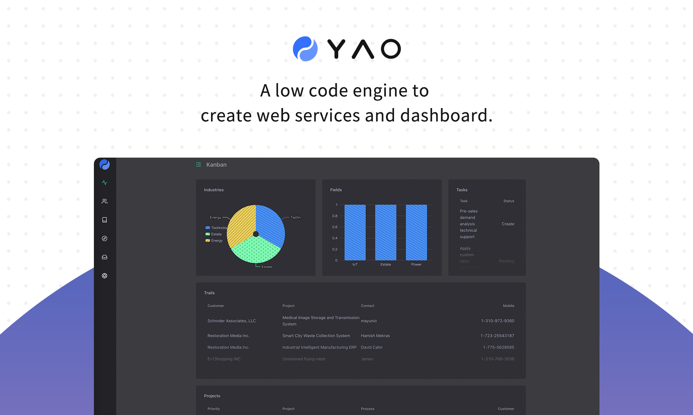

<p align="center">
  <a href="https://yaoapps.com">
    
    <h1 align="center">YAO</h1>
  </a>
</p>

<p align="center">
  <a aria-label="website" href="https://yaoapps.com" target="_blank">
    Website
  </a>
  ·
  <a aria-label="producthunt" href="https://www.producthunt.com/posts/yao-app-engine" target="_blank">
    Producthunt
  </a>
  ·
  <a aria-label="twitter" href="https://twitter.com/YaoApp" target="_blank">
    Twitter
  </a>
  ·
  <a aria-label="slack" href="https://join.slack.com/t/yaoapps/shared_invite/zt-13dm0cwvo-R9Q8xFGbrLZUffeygm9tXQ" target="_blank">
    Slack
  </a>
</p>

<p align="center">
  <a aria-label="UnitTest" href="https://github.com/YaoApp/yao/actions/workflows/unit-test.yml" target="_blank">
    
  </a>
  <a aria-label="codecov" href="https://codecov.io/gh/YaoApp/yao" target="_blank">
    
  </a>
  <a aria-label="Go Report Card" href="https://goreportcard.com/report/github.com/yaoapp/yao" target="_blank">
    
  </a>
  <a aria-label="Go Reference" href="https://pkg.go.dev/github.com/yaoapp/yao" target="_blank">
    
  </a>
</p>

[中文介绍](README.zh-CN.md)

## Demo

### Customer Relationship Management System

A Customer Relationship Management System developed by Yao.

[https://demo-crm.yaoapps.com](https://demo-crm.yaoapps.com/xiang/login/admin?autoLogin=true)

### Intelligent warehouse management system

An example of cloud + edge IoT application, an unattended intelligent warehouse management system that supports face recognition and RFID.

[https://demo-wms.yaoapps.com](https://demo-wms.yaoapps.com/xiang/login/admin?autoLogin=true)

## Introduce

**Yao allows developers to create web services by processes.** Yao is a low-code engine that creates a database model, writes API services, and describes dashboard interface just by JSON for web & hardware, no code, and 10x productivity.

Yao is based on the **flow-based** programming idea, developed in the **Go** language, and supports multiple ways to expand the data stream processor. This makes Yao extremely versatile, which can replace programming languages ​​in most scenarios, and is 10 times more efficient than traditional programming languages ​​in terms of reusability and coding efficiency; application performance and resource ratio Better than **PHP**, **JAVA** and other languages.

Yao has a built-in data management system. By writing **JSON** to describe the interface layout, 90% of the common interface interaction functions can be realized. It is especially suitable for quickly making various management background, CRM, ERP and other internal enterprise systems. Special interactive functions can also be implemented by writing extension components or HTML pages. The built-in management system is not coupled with Yao, and any front-end technologies such as **VUE** and **React** can be used to implement the management interface.

## Install

Run the script under terminal: (MacOS/Linux)

```bash
curl -fsSL https://website.yaoapps.com/install.sh | bash
```

For Windows users, please refer to the Installation and Debugging chapter: [Installation and debugging](https://yaoapps.com/en-US/doc/a.Introduction/b.Install)

## Getting Started

### Step 1: Create a project

Create a new project directory, enter the project directory, and run the `yao init` command to create a blank Yao application.

```bash
mkdir -p /data/crm # create project directory
cd /data/crm # Enter the project directory
yao init # run the initializer
```

After the command runs successfully, the `app.json file` , `db`, `ui` , `data` and other directories will be created

```bash
├── data # Used to store files generated by the application, such as pictures, PDFs, etc.
├── db # Used to store SQLite database files
│ └── yao.db
└── ui # The static file server file directory, where custom front-end products can be placed. The files in this directory can be accessed through http://host:port/filename .
└── app.json # Application configuration file, used to define the application name, etc.
```

### Step 2: Create the data table

Use the `yao migrate` command to create the data table, open the command line terminal, **run in the project root directory**:

```bash
yao migrate
```

initialization menu

```bash
yao run flows.setmenu
```

### Step 3: Start the service

Open a command line terminal, **run in the project root directory**:

```bash
yao start
```

1. Open a browser, visit `https://127.0.0.1:5099/xiang/login/admin`,

2. Enter the default username: `xiang@iqka.com`, password: `A123456p+`

## About Yao

Yao's name is derived from the Chinese character **yao (yáo)**, the basic symbol that makes up the Eight Trigrams. The Eight Trigrams is a symbol system created by the ancient god Fuxi after observing and summarizing the laws of nature, which can refer to everything. Yao has two states of yin and yang, like 0 and 1. The transformation of yin and yang of Yao drives the replacement of Eight Trigrams, so as to summarize and record the development law of things.
